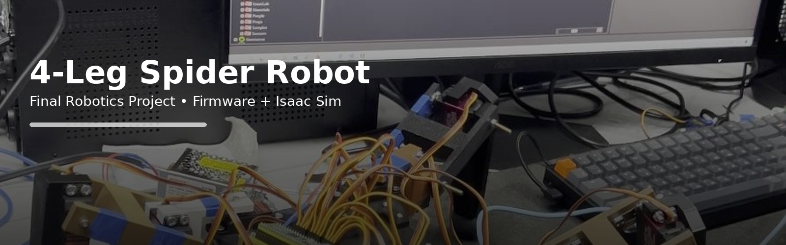
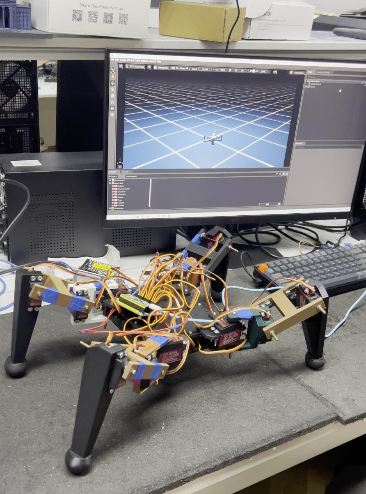
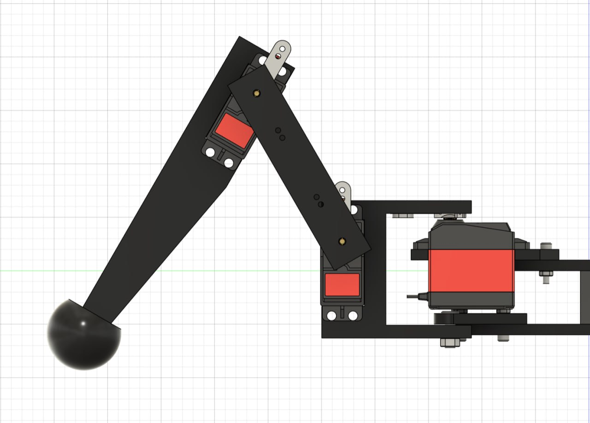
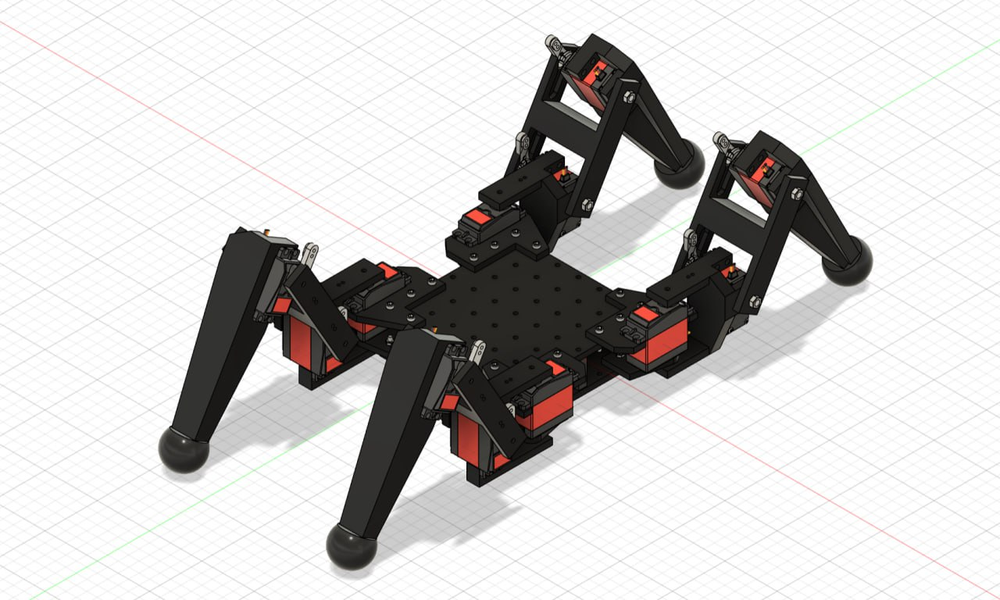

# 4‑Leg Spider Robot (Final Project)





A 4‑leg “spider” robot built as a final robotics project.  
This repository contains:

- **MicroPython firmware** for 12 servos (Raspberry Pi Pico or similar)
- **Isaac Sim** script to load the robot and play a keyframe gait
- Robot **URDF**, CAD renders, and demo media

## Quick repo map

- `firmware/pico/` — MicroPython servo control + gait demo
- `sim/isaac/` — Isaac Sim playback script
- `assets/urdf/` — URDF model
- `assets/images/` — photos and CAD renders
- `assets/demo/` — demo videos (tracked with Git LFS if you push to GitHub)
- `docs/` — project documentation (abstract, hardware, architecture, gait, simulation)

## Demo media

- `assets/demo/simulation_demo.mp4` — example video captured during development
- **Real robot walking video:** place it as `assets/demo/real_robot_walk.mp4` (recommended via Git LFS)

### Git LFS (recommended for videos)

```bash
git lfs install
git lfs track "*.mp4"
git add .gitattributes
git add assets/demo/real_robot_walk.mp4
git commit -m "Add real robot walking demo (LFS)"
git push
```

## Running the firmware (MicroPython)

1. Flash MicroPython to your board (e.g., Raspberry Pi Pico).
2. Open `firmware/pico/spider_firmware.py` in Thonny (or your IDE).
3. Adjust:
   - `NEUTRAL_OFFSETS` (per-joint calibration)
   - `DIRECTION_MAP` (fix mirrored joints)
   - `SERVO_PINS` if your wiring differs
4. Run the script and test joints **one by one** before running the gait cycle.

> Safety: power servos from a separate 5–6V supply with enough current. Do not power many servos directly from the Pico 5V pin.

## Running the Isaac Sim script

Isaac Sim typically runs in its own Python environment.  
See `docs/simulation.md` for setup notes and a clean way to point the script to your USD path.

## Gallery

**CAD leg mechanism**  


**CAD assembly**  


## Documentation

Start here:
- `docs/abstract.md`
- `docs/hardware.md`
- `docs/architecture.md`
- `docs/gait.md`
- `docs/simulation.md`
- `docs/firmware.md`

## License

MIT (see `LICENSE`).
