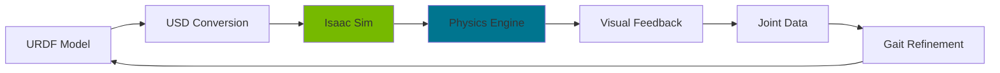

<div align="center">

# 🕷️ Quadruped Spider Robot

### *A 12-DOF Walking Robot with Simulation & Real-World Implementation*


[](https://opensource.org/licenses/MIT)
[](https://www.python.org/downloads/)
[](https://micropython.org/)
[](https://developer.nvidia.com/isaac-sim)

[](https://drive.google.com/drive/folders/1JOmnBiBbxM2T4DoV4F1_lLgWAIMYvdh8?usp=sharing)

[Features](#-features) • [Quick Start](#-quick-start) • [Hardware](#-hardware) • [Simulation](#-simulation) • [Documentation](#-documentation) • [Team](#-team)

</div>

---

## 📖 Overview

A biomimetic quadruped robot designed and built as a comprehensive robotics final project. This repository contains the complete software ecosystem including **MicroPython firmware** for real-time servo control, **NVIDIA Isaac Sim** integration for physics-based simulation, **URDF models**, CAD designs, and extensive documentation.

### 🎯 Project Goals

- ✅ Design a compact 4-legged robot with 12 degrees of freedom (3 DOF per leg)
- ✅ Implement stable trot gait locomotion with coordinated leg movement
- ✅ Develop reliable servo calibration and control pipeline
- ✅ Create accurate physics simulation for testing before hardware deployment
- ✅ Build modular, well-documented codebase for future enhancements

<div align="center">


*The completed quadruped robot in action*

</div>

---

## ✨ Features

<table>
<tr>
<td width="50%">

### 🤖 Hardware Control
- **12-Servo PWM Control** with MicroPython
- **Per-Joint Calibration** system (neutral offsets)
- **Direction Mapping** for kinematic accuracy on mirrored joints
- **Smooth Interpolation** for fluid motion
- **Real-time Gait Execution** (trot-style demo)

</td>
<td width="50%">

### 🖥️ Simulation
- **Isaac Sim Integration** with full physics
- **URDF-based Robot Model**
- **Keyframe Animation System**
- **PD Controller Tuning** (stiffness/damping)
- **Visual Trajectory Playback**

</td>
</tr>
</table>

### 🎮 Walking Capabilities

- **Trot Gait Pattern**: diagonal leg pairs for stable locomotion
- **Coordinated Movement**: Lift → Swing → Place → Pull sequence
- **Adjustable Parameters**: speed, stride length, lift height (by tuning keyframes/timing)
- **Smooth Transitions**: interpolated joint trajectories

---

## 🚀 Quick Start

### Prerequisites

```bash
# For Simulation
- NVIDIA GPU (RTX 2060 or better recommended)
- NVIDIA Isaac Sim 4.0+
- Python 3.10+

# For Hardware
- Raspberry Pi Pico (or compatible MicroPython board)
- 12x PWM Servo Motors
- 5-6V Power Supply (high current)
```

### 🎬 Simulation Demo

```bash
# Clone the repository
git clone https://github.com/yourusername/quadruped-spider-robot.git
cd quadruped-spider-robot

# Install dependencies (for tooling/tests; Isaac Sim runs in its own environment)
pip install -r requirements.txt

# Run Isaac Sim simulation (run using Isaac Sim Python environment)
cd sim/isaac
python robotSpiderSimulation.py
```

### 🔧 Hardware Deployment

```bash
# Flash MicroPython to Raspberry Pi Pico
# Download .uf2 from micropython.org and drag to RPI-RP2 drive

# Upload firmware
pip install adafruit-ampy
ampy --port /dev/ttyACM0 put firmware/pico/robotSpiderMove-1.py main.py

# Power on and watch it walk! 🎉
```

> ⚠️ Safety note: do NOT power 12 servos from the Pico 5V pin. Use a separate 5–6V supply with enough current, and connect grounds.

---

## 🏗️ Hardware

### System Architecture

```
┌─────────────────────────────────────────────────┐
│                 Control Board                   │
│             (Raspberry Pi Pico W)               │
│                                                 │
│  ┌──────────────────────────────────────────┐   │
│  │   MicroPython Firmware                   │   │
│  │   - PWM Generation (50Hz)                │   │
│  │   - Servo Calibration                    │   │
│  │   - Gait State Machine                   │   │
│  │   - Trajectory Interpolation             │   │
│  └──────────────────────────────────────────┘   │
└─────────────────────────────────────────────────┘
           │  │  │  │
           ▼  ▼  ▼  ▼
    ┌────────────────────┐
    │   12x Servo Motors │
    │                    │
    │  FL  FR  BL  BR    │
    │  🦿  🦿  🦿  🦿     │
    └────────────────────┘
```

### Leg Configuration

```
     Front
   FL ─── FR
    │     │
    │ 🕷️   │  (Body)
    │     │
   BL ─── BR
     Rear
```

**Each leg has 3 joints:**
- 🔄 **Hip (Coxa)**: horizontal rotation
- 📐 **Femur**: vertical lift
- 📏 **Tibia**: foot positioning

> 📘 **Detailed wiring guide**: See [`docs/hardware.md`](docs/hardware.md)

---

## 🎮 Simulation

### Isaac Sim Workflow

<div align="center">



</div>

### Key Features

- **Real-time Physics**: contact dynamics, friction, and gravity effects
- **Visual Debugging**: 3D visualization of joint movements
- **Parameter Tuning**: PD gains, limits, keyframe timing
- **Trajectory Playback**: interpolated joint targets for smooth motion

### Running Simulations

```bash
# Basic simulation
python sim/isaac/robotSpiderSimulation.py
```

> Note: if you want CLI flags like `--cycles` / `--stiffness`, implement argument parsing inside the script first.

### Demo Videos

<table>
<tr>
<td width="50%" align="center">

**🎥 Simulation Demo**

[](https://drive.google.com/drive/folders/1JOmnBiBbxM2T4DoV4F1_lLgWAIMYvdh8?usp=sharing)


</td>
<td width="50%" align="center">

**🎥 Real Robot Demo**

[](https://drive.google.com/drive/folders/1JOmnBiBbxM2T4DoV4F1_lLgWAIMYvdh8?usp=sharing)

</td>
</tr>
</table>

---

## 📁 Repository Structure

```
quadruped-spider-robot/
│
├── 📁 firmware/
│   └── pico/
│       ├── robotSpiderMove-1.py    # Main control firmware
│       ├── servo_test.py            # Individual servo testing (optional)
│       └── calibration.py           # Calibration utilities (optional)
│
├── 📁 sim/
│   └── isaac/
│       ├── robotSpiderSimulation.py # Isaac Sim main script
│       └── config/
│           └── simulation.yaml      # Simulation parameters (optional)
│
├── 📁 assets/
│   ├── urdf/
│   │   ├── paukrobotFinished.urdf   # Robot URDF model
│   │   └── meshes/                  # STL/mesh files (if available)
│   ├── images/
│   │   ├── banner.png
│   │   ├── spider_robot_real.jpg
│   │   └── cad_renders/
│   └── demo/
│       ├── simulation_demo.mp4
│       └── real_robot_walk.mp4      # (optional, usually via Git LFS)
│
├── 📁 docs/
│   ├── abstract.md                  # Project abstract
│   ├── hardware.md                  # Hardware guide
│   ├── architecture.md              # System architecture
│   ├── gait_planning.md             # Gait implementation
│   ├── simulation.md                # Simulation setup
│   └── firmware.md                  # Firmware documentation
│
├── 📄 README.md                     # This file
├── 📄 QUICKSTART.md                 # 5-minute setup guide
├── 📄 requirements.txt              # Python dependencies
├── 📄 LICENSE                       # MIT License
└── 📄 .gitattributes                # Git LFS configuration
```
## 🧩 Control Flow Diagram


## 📚 Documentation

| Document | Description |
|----------|-------------|
| [**Abstract**](docs/abstract.md) | Project overview and objectives |
| [**Hardware Guide**](docs/hardware.md) | Wiring, assembly, and components |
| [**Architecture**](docs/architecture.md) | System design and data flow |
| [**Gait Planning**](docs/gait_planning.md) | Movement algorithms and tuning |
| [**Simulation**](docs/simulation.md) | Isaac Sim setup and usage |
| [**Firmware**](docs/firmware.md) | MicroPython implementation details |
| [**Quick Start**](QUICKSTART.md) | Get running in 5 minutes |

---


## 🛠️ Development

### Building from Source

```bash
# Clone repository
git clone https://github.com/yourusername/quadruped-spider-robot.git
cd quadruped-spider-robot

# Create virtual environment
python -m venv venv
source venv/bin/activate  # On Windows: venv\Scripts\activate

# Install dependencies
pip install -r requirements.txt
```

---

## 👥 Team

- Kaldybekov Adilkhan  
- Bolat Aliyanur  
- Jumashev Tair  
- Ridvan Tairov  

---

## 🎓 Academic Context

**Institution**: Kazakh-British Technical University (KBTU)  
**Course**: Robotics Final Project  
**Semester**: Autumn 2024  
**Advisor**: Ilyas Muhammad

---

## 📄 License

This project is licensed under the MIT License - see the [LICENSE](LICENSE) file for details.

```
MIT License

Copyright (c) 2024 Kaldybekov Adilkhan, Bolat Aliyanur,
                     Jumashev Tair, Ridvan Tairov

Permission is hereby granted, free of charge, to any person obtaining a copy...
```

---

## 🙏 Acknowledgments

- **NVIDIA** for Isaac Sim simulation platform
- **MicroPython** community for embedded Python support
- **ROS** community for URDF standards
- Our advisor and peers for invaluable feedback

</div>
